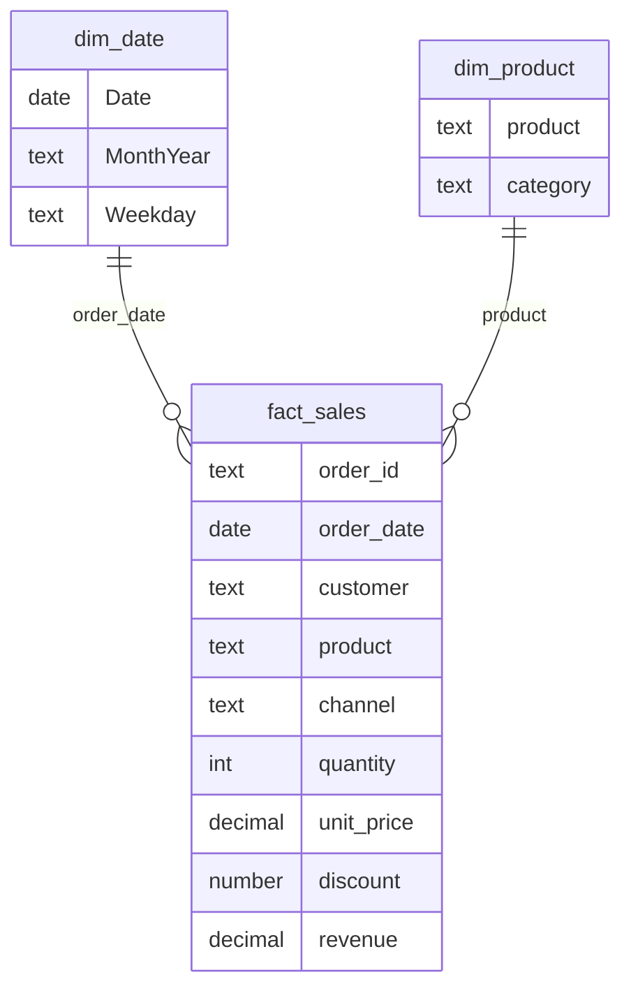

# Sales Performance Dashboard (Power BI)

A two-page Power BI dashboard on top of the sales warehouse from
[sales-data-etl-pipeline](https://github.com/Adnan040404/sales-data-etl-pipeline).
The ETL project cleans the data; this one is the reporting layer a manager would
actually open.

The data is synthetic, so the numbers are examples and not real results.

> **Status:** the project files are generated and checked, but not yet opened in
> Power BI Desktop, and there are no screenshots yet. This README gets updated
> once that's done.

## Pages

1. **Overview**: date, category and channel slicers; KPI cards for revenue,
   orders, units, average order value and active customers; revenue by month,
   channel, category and product; and a monthly table with month-over-month growth.
2. **Products & Channels**: a category > product matrix with units, revenue and
   share; a category mix treemap; and revenue by weekday.

## Data model

A small star schema.



`dim_date` is marked as the date table, so time-intelligence measures work. Month
and weekday labels sort by their number columns, so charts read in calendar order
instead of alphabetically.

## Measures

All 14 are in `powerbi/measures.dax`. The main ones:

| Measure | Definition |
|---|---|
| Total Revenue | `SUM(fact_sales[revenue])` |
| Avg Order Value | `DIVIDE([Total Revenue], [Orders])` |
| Revenue MoM % | growth against the previous calendar month, built on `DATEADD` |
| Revenue Share % | revenue as a share of the current slicer selection, using `ALLSELECTED()` |
| Active Customers | distinct named customers (rows marked "Unknown" are excluded) |

## Opening it

You need Power BI Desktop and to be signed in.

Open `Sales Performance Dashboard.pbip`. The data is stored inside the model, so
there are no file paths to fix and no refresh needed.

If Desktop shows an "Issues were found" message, send me the text and I'll fix
the project. If it can't be fixed quickly, the model can be rebuilt by hand:
import the three CSVs, relate `order_date` to `dim_date[Date]` and `product` to
`dim_product[product]`, mark `dim_date` as a date table, and paste the measures
from `powerbi/measures.dax`.

## Refreshing the data

```bash
python export_data.py    # rewrites data/*.csv from the ETL warehouse
python build_project.py  # regenerates the Power BI project, embedding the new data
```

## What has been checked

- The report files (pages and visuals) validate against Power BI's own JSON
  schemas, using the schema versions bundled with Desktop 2.147.
- Power BI's model parser loads the semantic model: 4 tables, 14 measures, 2
  relationships and the date table.
- The data embedded in the model matches the CSV files row for row.
- Every field used by a visual exists in the model (36 references checked).
- Not checked yet: that Desktop renders it as intended.

## Layout

```
Sales Performance Dashboard.pbip           open this
Sales Performance Dashboard.SemanticModel/ tables, relationships, measures (TMDL)
Sales Performance Dashboard.Report/        pages, visuals and theme (PBIR)
data/                                      fact_sales, dim_date, dim_product CSVs (source of the embedded data)
powerbi/measures.dax                       the measures as plain text
export_data.py  build_project.py           data export and project generator
```

## Contact

Muhammad Adnan, [LinkedIn](https://linkedin.com/in/muhammad-adnan-740336293),
adnandanish0404@gmail.com
